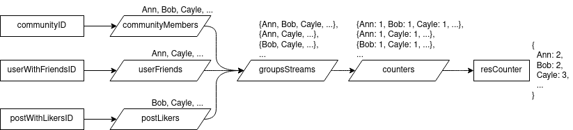

# Stream and functional utilities
[](https://pkg.go.dev/github.com/rprtr258/go-flow)
[](https://goreportcard.com/report/github.com/rprtr258/go-flow)


The design is inspired by rust [iterators](https://doc.rust-lang.org/std/iter/trait.Iterator.html) and [Result](https://doc.rust-lang.org/std/result/enum.Result.html).

## Result processing
Can be used with old functions:
- returning Go style result/error
```go
func OpenFile(name string) result.Result[*os.File] {
	return result.FromGoResult(os.Open(name))
}

func UnmarshalJson[J any](body []byte) r.Result[J] {
	return r.Eval(func() (j J, err error) {
		err = json.Unmarshal(body, &j)
		return
	})
}

```
- returning result/isValid
```go
// LookupEnv gets environment variable
func LookupEnv(varName string) result.Result[string] {
	return result.FromMaybe(os.LookupEnv(varName)).
		ChangeErr(fmt.Errorf("env var %q is not defined", varName))
}

// LookupIntEnv gets environment variable and parses it to int
func LookupIntEnv(varName string) result.Result[int] {
	return result.FlatMap(
		LookupEnv(varName),
		result.ToKleisli(strconv.Atoi),
	)
}
```
- back to go style result/error
```go
func Process(x int) (int, error) (
	result := // some go-flow processing using Result-s
	return result.GoResult()
}
```
## Stream processing
`Stream[A]` is stream of values of one type `A`. They can be finite or infinite. Work with streams is supposed to be divided into three steps:
1. Create stream. Either from slice, map, channel, etc. or you can make stream using dedicated functions. Also you can implement `Stream[A]` interface to make any kind of stream you want to!
2. Process stream. Generally when one stream is created using another, old stream should not be used:
```go
xs := // some stream
ys := Map(xs, f)
// don't use xs from now on
```
3. Destroy stream to single value.

In such way you can build different pipelines. For example there is sample pipeline for counting users' memberships:



How to implement it using streams:
```go
// Count how many groups users belong to. Groups are:
//   - some community
//   - user's friends
//   - post likers
func CountMemberships(communityID, userID, postID uint) fun.Counter[User] {
	communityMembers := getCommunityMembers(communityID)
	userFriends := getFriends(userID)
	postLikers := getLikers(postID)
	groupsStreams := stream.Gather([]stream.Stream[stream.Stream[User]]{
		communityMembers,
		userFriends,
		postLikers,
	})
	counters := stream.Map(chans, stream.CollectCounter[User])
	resCounter := stream.Reduce(fun.NewCounter[User](), fun.CounterPlus[User], counters)
	return resCounter
}
```
